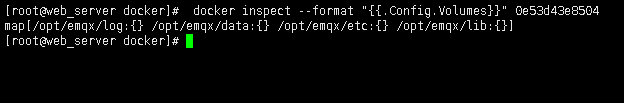
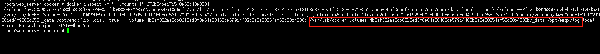
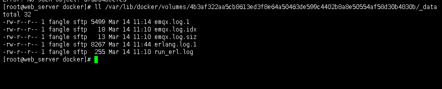

#### 启动命令

```
docker run -d \
    -p 1883:1883 -p 8083:8083 -p 8883:8883 -p 8084:8084 -p 18083:18083 \
    -e MYSQL_IP="192.168.88.139" \
    -e MYSQL_PORT="3306" \
    -e MYSQL_USERNAME="root" \
    -e MYSQL_PASSWORD=123456 \
    -e MYSQL_DATABASE="mqtt" \
    -e PASSWORD_HASH="sha256" \
    -e ACCEPTORS=64 \
    -e MAX_CONNECTIONS=1000000 \
    -e USERNAME="fangle" \
    -e PASSWORD="fangle123" \
    qiujiahong/emqx-docker:v3.0-mysql-acl
```
#### 参数说明
###### TCP 监听器的 Acceptor 池大小，最大允许连接数
```
ACCEPTORS: 池大小
MAX_CONNECTIONS: 最大允许连接数
```
###### 登录web页面Dashboard的用户名密码
```
USERNAME: 用户名
PASSWORD: 密码
```
#### 查看日志
##### 基础镜像已经默认挂载log文件夹出来了，所以我们用以下命令直接就可以查看到日志
```
#查看容器内需要挂载的目录
docker inspect --format "{{.Config.Volumes}}" 0e53d43e8504

#查看宿主机所挂载的目录
docker inspect -f "{{.Mounts}}" 676b04bec7c5 0e53d43e8504
```
 
 
###### 第二个图我们可以知道log/这个文件夹在“/var/lib/docker/volumes/4b3af322aa5cb8613ed3f8e64a50463de599c4402b8a8e50554af58d30b4830b/_data”这个文件夹里面，那么
